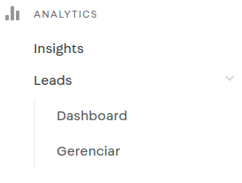
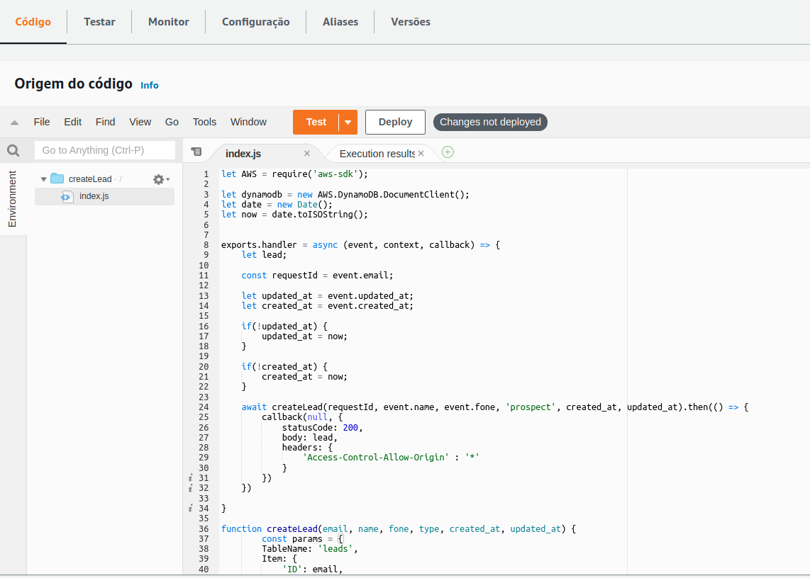
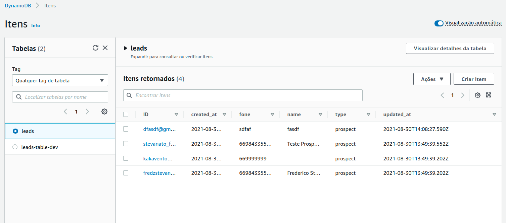
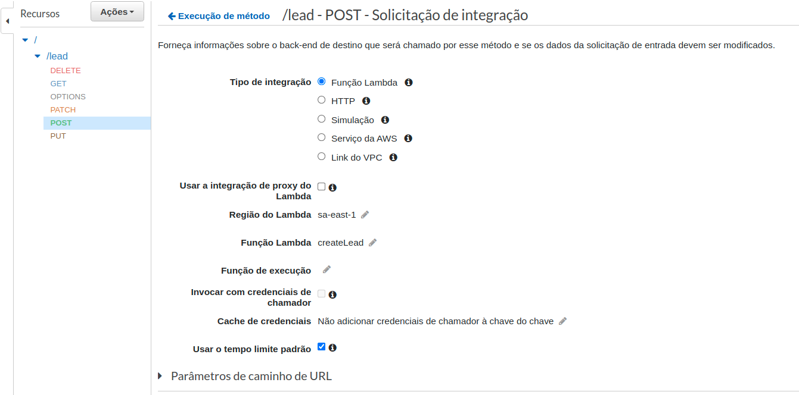

# Componentes

## VTEX IO

#### Integração com ambiente em desenvolvimento

  1. git clone https://github.com/fredzstevanato/hiringcoders-app-admin.git
  2. entrar no diretório do app e utilizar *vtex link -u*
  3. git clone https://github.com/fredzstevanato/front-loja-app.git
  4. entrar no diretório do frontend e executar *vtex link*
  5. Para que o app seja listado pelo frontend faça a alteração dos seguintes arquvios:
    - no manifest.json
      insira no final: *"hiringcoders202105.service-hiringcoders": "0.x"* 
    - logo em segui será possivel utilizar os seguintes apps:
      * "capture-data",
      * "list-all-leads",
      * "update-data"
  
#### ADMIN (Dashboard e AdminLeads)

 1. [AdminLeads](https://stevanato--hiringcoders202105.myvtex.com/admin/leads): realiza o gerenciamento dos LEADS no pagina ADMIM da VTEX, com ele é possivel inserir, deletar e alterar os leads (com fins didáticos) cadastrados através da AWS (Lambda, DynamoDB e Gateway API)
  
 2. [Dashboard](https://stevanato--hiringcoders202105.myvtex.com/admin/dashboard): Parte visual que verifica as estatisticas dos Leads, como por exemplo a taxa de conversão, não foi implementada.

  |          menu           |   2   |   3   |
  | :---------------------: | :---: | :---: |
  |  | Valor | Valor |

#### Front (CaptureData, ListAllLeads, UpdateLeadData)

  1. CapturaData: Componente criado como formulário que pode ser inserido em qualquer do frontend, para que insere os dados na AWS.
  
  ~~~
    Padrão de body: {
      ID: string (utilizado o e-mail)
      name: string
      type: string ( prospect | lead )
      created_at: string
      updated_at: string
    }
  ~~~
    
  2. ListAllLeads: Criando como função para listar as capturas realizadas através do formulário CapturaData;

  3. UpdateLeadData: Função que atráves da api da VTEX captura o usuário logado, verifica se o usuário está cadastrado no DynamoDB, caso esteja cadastado ele atualiza o campo "type" para "leads".

~~~
  useEffect(() => {
    async function getUrl() {
      const response = await api.get(`https://stevanato--hiringcoders202105.myvtex.com/api/vtexid/pub/authenticated/user`)

      if (response.data.user) {
        setEmail(response.data.user)
        return
      }
    }
    getUrl()
    console.log(email)
  }, [email])
~~~

## AWS 

  |                           LAMBDA                           |
  | :--------------------------------------------------------: |
  |  |

|                          DYNAMODB                          |
| :--------------------------------------------------------: |
|  |

|                           API GATEWAY                           |
| :-------------------------------------------------------------: |
|  |
|                                                                 |